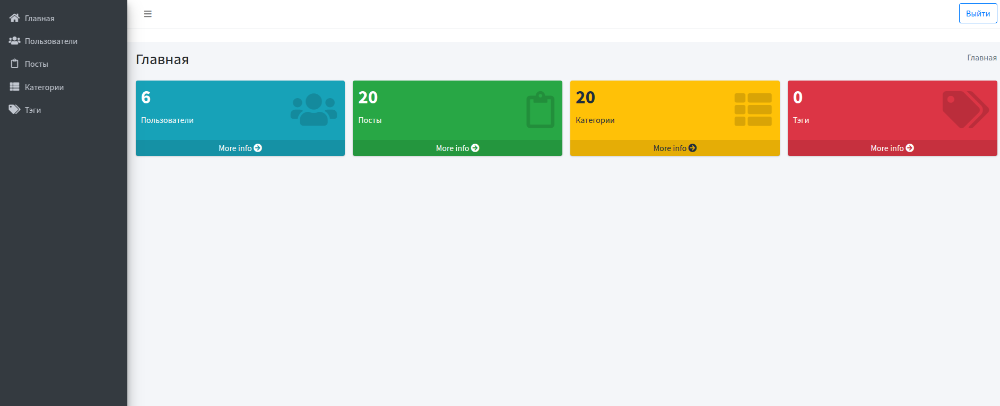

# Blog
 Simple blog project with an admin panel. Supports managing posts, categories, and users through a web interface.

___
## Installation
To start the project, run:
`./install.sh`

Access:
main page: http://localhost:8876/
admin panel: http://localhost:8876/admin

Default Admin Credentials:
login: admin@admin.admin
password: admin

Admin panel:

